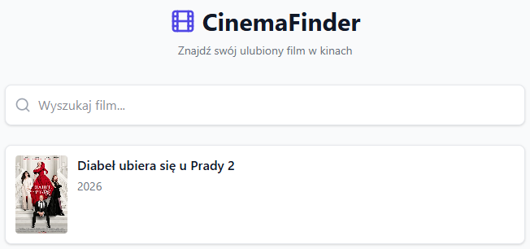
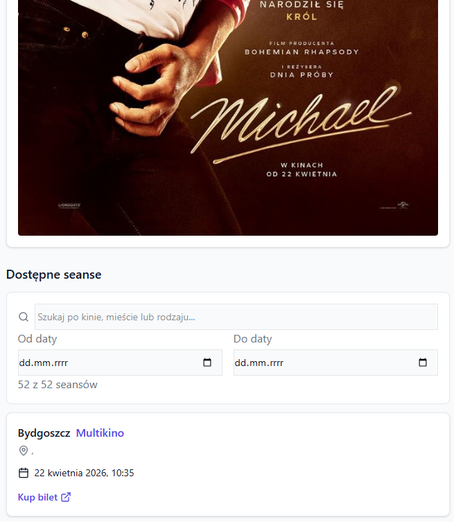

# CinemaFinder

A web application for searching movies and finding cinema screenings across Poland. Browse current screenings at **Cinema City** and **Multikino** chains, filter by city, date, and provider, then buy tickets directly.

## Tech Stack

- **Next.js 16** (App Router)
- **React 19**
- **TypeScript 5**
- **Tailwind CSS v4**

## Getting Started

### Prerequisites

- Node.js 18+
- A running backend API server (default: `http://localhost:8080`)

### Installation

```bash
npm install
```

### Configuration

Create a `.env.local` file:

```env
NEXT_PUBLIC_API_BASE_URL=http://localhost:8080
```

### Run

```bash
# Development
npm run dev

# Production
npm run build
npm run start
```

Open [http://localhost:3000](http://localhost:3000).

## Project Structure

```
app/
  page.tsx                    # Home — movie search
  api/movies/route.ts         # Movies API proxy
  api/screenings/route.ts     # Screenings API proxy
  movies/[id]/                # Movie details + screenings
components/
  SearchBar.tsx               # Search input with debounce
  MovieCard.tsx               # Movie poster card
  MovieList.tsx               # Movie grid with empty state
  ScreeningCard.tsx           # Screening info + ticket link
  ScreeningList.tsx           # Filterable screenings list
  LoadingSpinner.tsx          # Loading indicator
  ErrorMessage.tsx            # Error display
types/index.ts                # TypeScript interfaces
constants/providers.ts        # Cinema provider names
docs/API.md                   # Backend API documentation
```

## Features

- Movie search with auto-complete debounce (300ms)
- Screening filters: text search, date range, provider
- Provider badges (Cinema City, Multikino)
- Direct ticket purchase links
- Responsive design with poster fallbacks
- Polish language UI

## Screenshots




## API

The frontend proxies requests to a separate backend through two endpoints:

| Endpoint | Purpose |
|---|---|
| `GET /api/movies?q=<query>` | Search movies with active screenings |
| `GET /api/screenings?movieId=<id>` | Get future screenings for a movie |

See [`docs/API.md`](docs/API.md) for full backend documentation.

## Scripts

```bash
npm run dev       # Start dev server
npm run build     # Production build
npm run start     # Start production server
npm run lint      # Run ESLint
```
